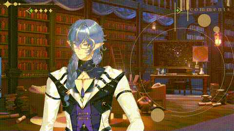

# EmojiHead

Replaces your VTuber model's face with a Twitch emote. Hides the face artmeshes and pins the emote to the head so it tracks with movement. Hair, ears, and accessories stay visible in front.



## Usage

- `!emojihead <emote>` — replaces the face with that emote (or swaps to a new one if already active)
- `!emojihead off` — restores the face

## Streamer.bot Extension

A ready-to-import Streamer.bot action — no separate programs needed. See the [streamerbot/](streamerbot/) folder for setup instructions.

## Standalone (TypeScript)

Connects to VTube Studio and Twitch chat. Downloads emotes directly from chat messages.

### Requirements

- Node.js 18+
- VTube Studio with API enabled
- Twitch app credentials

### Setup

1. `cd` into the `EmojiHead/standalone` folder
2. `npm install`
3. Copy `.env.example` to `.env` and fill in your credentials
4. Put your emote PNG in the `emotes/` folder

### Running It

```
npm start
```

Press **Ctrl+C** to stop.

### Configuration

Edit `src/config.ts`:

- **`PIN_ARTMESH`** — which artmesh to pin the emote to (default: `"FaceColorMain"`)
- **`DEFAULT_EMOTE_PATH`** — path to the emote image (default: `"./emotes/brainded.png"`)
- **`EMOTE_SIZE`** — size of the emote (0-1, default: `0.62`)
- **`TRIGGER_COMMAND`** — chat command (default: `"!emojihead"`)
- **`FACE_HIDE_PATTERNS`** — list of artmesh name patterns to hide (see comments in file)
