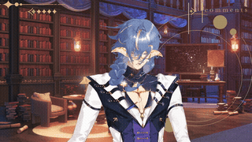

# GetDown

VTube Studio plugin that triggers erratic random movement.



## Standalone (Python)

A Python script that connects directly to VTube Studio. Runs until you press Ctrl+C.

### Requirements

- Python 3.8+

### Setup

1. `cd` into the `GetDown/standalone` folder
2. `pip install -r requirements.txt`

### Running It

1. Make sure **VTube Studio is open** and the **API is enabled** (see [VTube Studio Setup](../README.md#vtube-studio-setup))
2. Run the script:
   ```
   python random_movement.py
   ```
3. The first time you run it, **VTube Studio will show a popup** asking you to allow the plugin — click **Allow**
4. Press **Ctrl+C** to stop

### Configuration

Open `random_movement.py` in any text editor (Notepad works fine) and change these values near the top:

- **`API_URL`** — If VTube Studio shows a different port number than `8004`, change this to match (e.g., `"ws://localhost:8001"`)
- **`FPS`** — How many times per second the parameters update (default: `30`)

### Troubleshooting

- **"Could not connect to VTube Studio"** — Make sure VTube Studio is running and the API is enabled. Check that the port number in the script matches VTube Studio's port.
- **"Authentication failed"** — You need to click Allow on the popup in VTube Studio. Try running the script again and watch for the popup.
- **"python is not recognized"** — Python isn't installed or wasn't added to PATH. Reinstall Python and make sure to check "Add Python to PATH".
- **"pip is not recognized"** — Try `python -m pip install -r requirements.txt` instead.

## Streamer.bot Extension

A C# action for Streamer.bot — no separate programs needed. See the [streamerbot/](streamerbot/) folder for full setup instructions.

## Break Model (Advanced)

There's also `standalone/break_model.py` — this modifies your model's physics file to remove damping and crank all the physics values way up.

**WARNING:** This edits your model's files directly. It creates a backup automatically, but make sure you understand what it does before running it. If you aren't sure, probobly don't do it. See the comments at the top of the file for details.

To restore your model to normal after using it:
```
python break_model.py --restore
```
